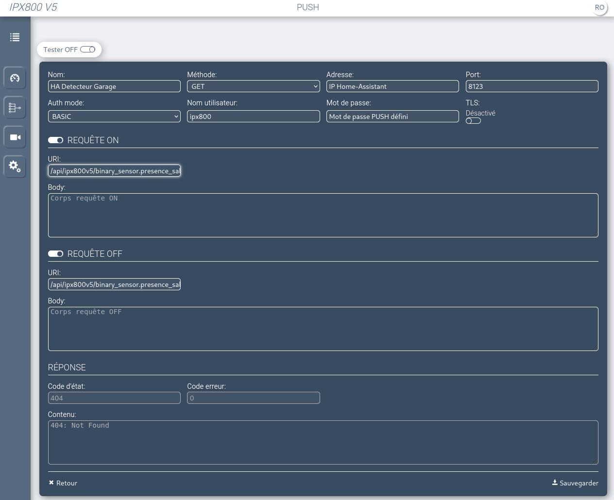
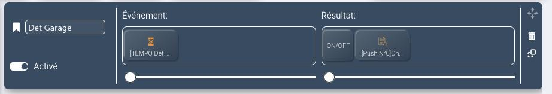

# Intégration ipx800v5 pour Home Assistant

  [](https://github.com/sponsors/Aohzan) [](https://github.com/hacs/integration)

Ceci est un _custom component_ ou une intégration pour [Home Assistant](https://www.home-assistant.io/).
L'intégration `ipx800v5` vous permet de contrôler et récupérer des informations depuis votre [IPX800 v5 et ses extensions](http://gce-electronics.com/).

## Fonctionnalités

- IPX800 [`ipx`]
  - Relais via `switch` ou `light`
  - Sorties collecteurs ouverts via `switch` (en spécifiant `type: opencoll` dans la configuration yaml)
  - Entrées digitales via `binary_sensor`
  - Entrées opto-isolées via `binary_sensor` (en spécifiant `type: opto` dans la configuration yaml)
  - Entrées analogiques via `sensor`
  - Informations systèmes via `sensor`
  - Reboot via `button`
- Extensions
  - X-8R via `switch` ou `light` pour les relais, `binary_sensor` pour l'appui long [`x8r`]
  - X-Dimmer via `light` [`xdimmer`]
  - X-PWM via `light` [`xpwm`]
  - X-THL via `sensor` [`xthl`]
  - X-4FP via `climate` [`x4fp`]
  - X-4VR via `cover` [`x4vr`]
  - X-8D via `binary_sensor` [`x8d`]
  - X-24D via `binary_sensor` [`x24d`]
  - X-010V via `light` pour la gestion du niveau de sortie [`x010v`]
- Objets
  - Thermostat via `climate` et `number` pour les réglages de preset [`thermostat`]
  - Counter via `number` [`counter`]
  - Tempo via `binary_sensor`, `switch` pour l'activer ou non et `number` pour régler la temporisation [`tempo`]
- Entités spécifiques (en yaml uniquement via l'attribut `type`)
  - `io` via `switch` ou `binary_sensor`
  - `ana` via `sensor` ou `number`
  - `xpwm_rgb` et `xpwm_rgbw` via `light` pour piloter une lumière et sa couleur via plusieurs canaux PWM

## Installation

### HACS

HACS > Intégrations > Explorer & Ajouter des repos > GCE IPX800 V5 > Installer ce repository

### Manually

Copiez le répertoire  `custom_components/ipx800v5` dans le répertoire `config/custom_components` de votre Home Assistant (les fichiers `*.py` doivent être dans `config/custom_components/ipx800v5`).

## Configuration

### Simple

Depuis le menu `Configuration` puis `Intégrations` ajouter GCE IPX800V5 via le bouton puis suivez les instructions.

### Avancé

Si vous souhaitez :

- Pouvoir ajouter des variables IO et ANA
- Personnaliser en yaml des propriétés de vos entités (nom, icone, device class...)
- Utiliser des entités avancées : climate via diode fil pilote, RGB(W) sur le X-PWM

Ajoutez votre configuration `ipx800v5` dans votre fichier `configuration.yaml`.

#### Paramètres

##### IPX800

| Key             | Type   | Required | Default   | Description                                                                                                            |
| --------------- | ------ | -------- | --------- | ---------------------------------------------------------------------------------------------------------------------- |
| `name`          | string | yes      | IPX800 V5 | Nom de votre IPX800                                                                                                    |
| `host`          | string | yes      | -         | IP de votre IPX800                                                                                                     |
| `port`          | port   | no       | 80        | Port de votre IPX800                                                                                                   |
| `api_key`       | string | yes      | -         | Clé API configurée (http://IP_IPX800/#/system/apikey)                                                                  |
| `push_password` | string | no       | -         | Password pour activer les PUSH depuis l'IPX800 [voir ici](#PUSH)                                                       |
| `devices_auto`  | list   | no       | -         | Ajout d'appareils automatiquement pour les extensions ou objets spécifiés [voir code entre crochets](#Fonctionnalités) |
| `diag_sensors`  | bool   | no       | False     | Ajout des sensors de diagnostiques |
| `devices`       | list   | no       | -         | Liste d'appareils à ajouter manuellement [configuration](#Devices)                                                     |

##### Devices

| Key            | Type       | Required | Default | Description                                                                          |
| -------------- | ---------- | -------- | ------- | ------------------------------------------------------------------------------------ |
| `name`         | string     | yes      | -       | Nom du l'appareil                                                                    |
| `ext_type`     | string     | yes      | -       | Type d'extension ou d'objet [voir code entre crochets](#Fonctionnalités)             |
| `ext_number`   | string     | no       | -       | Numéro d'extension, à partir de 0 (requis sauf pour `ipx`)                           |
| `ext_name`     | string     | no       | -       | Nom de l'extension                                                                   |
| `component`    | string     | yes      | -       | Type d'entité       [voir les types concernés par extension/objet](#Fonctionnalités) |
| `io_number`    | int        | no       | -       | Numéro de l'entrée/sortie concernée                                                  |
| `io_numbers`   | array[int] | no       | -       | Numéros des entrées/sorties concernées (pour `climate` et `xpwm_rgb`)                |
| `icon`         | string     | no       | -       | Icône                                                                                |
| `device_class` | string     | no       | -       | Device class                                                                         |
| `transition`   | int        | no       | -       | Délais de changement d'état                                                          |
| `type`         | string     | no       | -       | Type d'entité spécifique  [voir les possibilités](#Fonctionnalités)                  |

#### Exemple

```yaml
ipx800v5:
  - name: IPX800 V5
    host: 192.168.1.240
    api_key: !secret ipx800_apikey
    push_password: !secret ipx800_push
    devices_auto:
      - ipx
      - x8r
      - tempo
      - thermostat
    devices:
      ## ipx
      - name: VMC
        ext_type: ipx
        io_number: 3
        component: switch
        icon: mdi:hvac
      - component: binary_sensor
        name: Sonnette
        ext_type: ipx
        io_number: 1
        icon: mdi:bell-circle-outline
      - name: Mon Virtual IO
        component: switch
        ext_type: ipx
        type: io
        id: 65703
      - name: Luminosité Cuisine
        ext_type: ipx
        io_number: 1
        component: sensor
        device_class: illuminance
        icon: mdi:white-balance-sunny
      - name: Ma sortie collecteur ouvert
        component: "switch"
        ext_type: ipx
        type: opencoll
        io_number: 4
      - component: binary_sensor
        name: Mon entrée opto-isolée
        ext_type: ipx
        type: opto
        io_number: 3
      ## x8r
      - name: Porte Garage
        ext_type: x8r
        ext_number: 0
        io_number: 1
        component: switch
      - name: Lumière Garage
        ext_type: x8r
        ext_number: 0
        io_number: 2
        component: light
      - name: Lumière Entrée
        ext_type: x8r
        ext_number: 1
        io_number: 1
        component: light
      ## xdimmer
      - name: Lumière Salle à Manger
        ext_type: xdimmer
        ext_number: 0
        io_number: 1
        component: light
      ## xpwm
      - name: Spots Cuisine
        ext_type: xpwm
        ext_number: 0
        io_number: 1
        component: light
      - name: Bandeau de LED RGB
        ext_type: xpwm
        ext_number: 0
        io_numbers: [9, 10, 11, 12]
        type: xpwm_rgbw
        transition: 1.5
      ## xthl
      - name: Capteur Rez-de-Chaussée
        component: sensor
        ext_type: xthl
        ext_number: 0
      ## objet thermostat
      - name: Thermostat
        component: climate
        ext_type: thermostat
        ext_number: 0
      ## objet tempo
      - name: Présence Garage
        ext_type: tempo
        ext_number: 0
        component: binary_sensor
        device_class: motion
      ## climate avec diode fil pilote 
      - name: Sèche-Serviettes Salle de bains
        component: climate
        ext_type: ipx
        io_numbers: [7, 8]
```

## PUSH

### Demande d'actualisation des états

En faisant un appel PUSH depuis l'IPX sur l'URL `/api/ipx800v5_refresh/on`, vous demandez à Home-Assistant de rafraichir l'état de toutes les entités.

### Poussez l'état d'une entité

Vous pouvez configurer des PUSH depuis votre IPX800 pour avoir l'état d'une entité mise à jour instantanément sans attendre la prochaine mise à jour.

Premièrement, ajouter le mot de passe push dans votre configuration, dans les options de l'intégration via l'UI ou en yaml

Ensuite, deux solutions:

#### Création manuelle (simple)

Créez un PUSH dans les liens > Objets > Push, avec les éléments suivant

- `Adresse`: Adresse IP de votre Home-Assisant
- `Port`: Port de votre Home-Assistant (par défaut `8123`)
- `Nom utilisateur`: `ipx800`
- `Mot de passe`: Votre mot de passe
- `Requête ON` - `URI`: personnalisez avec votre entité : `/api/ipx800v5/votre_entite/on` (exemple `/api/ipx800v5/binary_sensor.detecteur_garage/on`)
- `Requête ON` - `URI`: La même chose avec `off` à la place de `on` : `/api/ipx800v5/votre_entite/off`

Exemple:


Ensuite créer une scène pour activer votre PUSH avec un ON/OFF selon votre souhait, exemple ici avec un tempo:


#### Création automatique (avancé)

Il est possible de créer automatiquement l'objet PUSH dans votre configuration, via un service Home-Assistant appelé `ipx800v5.create_push_object`.
Vous devez fournir:

- `Auth Token`: afin d'être autorisé à créer un PUSH, il faut récupérer un token d'authentification de niveau 2 ou plus depuis l'IP du Home-Assisant, c'et donc assez compliqué et demande de faire un proxy sur ce dernier, une fois fait, allez sur l'interface web de votre IPX, activez le mode développeur (F12 généralement) et récupérez le `AuthToken` sur les url envoyées à votre IPX (exemple: `XHRGET http://192.168.1.123/api/core/str?AuthToken=a1b2c3d4e5g6 [HTTP/1.1 202 Accepted 14ms]` => le token est `a1b2c3d4e5g6`)
- `Entity`: l'entité que vous voulez mettre à jour (exemple: `binary_sensor.capteur_garage`)
- `Home-Assistant IP`: l'IP de votre Home-Assistant (exemple: `192.168.1.234`)
- `Home-Assistant Port`: le port HTTP de votre Home-Assistant (exemple par défaut: `8123`)

Ensuite créer une scène pour activer le nouveau PUSH créé avec un ON/OFF selon votre souhait, exemple ici avec un tempo:


### Poussez l'état de pusieurs entités

Même chose que précédemment, en séparant par des `&`, exemple : `/api/ipx800v5/votre_entite=on&votre_autre_entite=off`.
